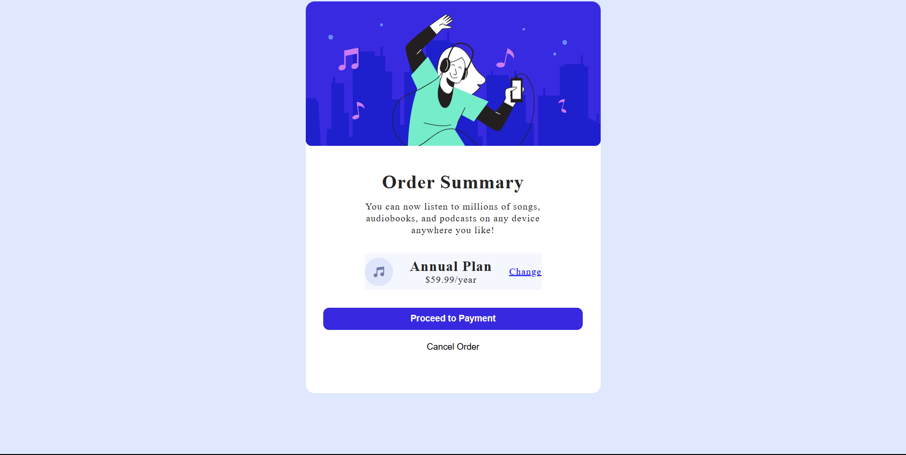

# Order-Summary
## Overview
This repository contains the implementation of a checkout page for an audio streaming subscription service.

## Description
The checkout page displays an order summary for an annual subscription plan to an audio streaming service, allowing users to review their selection before proceeding to payment.

## Features
- Order summary display
- Subscription details ($59.99/year)
- Plan change option
- Payment processing
- Order cancellation

## Screenshot

## Implementation Details
- HTML/CSS for layout and styling
- Responsive design for cross-device compatibility

## How to Use
1. Clone the repository
2. Open `index.html` in your browser
3. Modify as needed for your project

 
